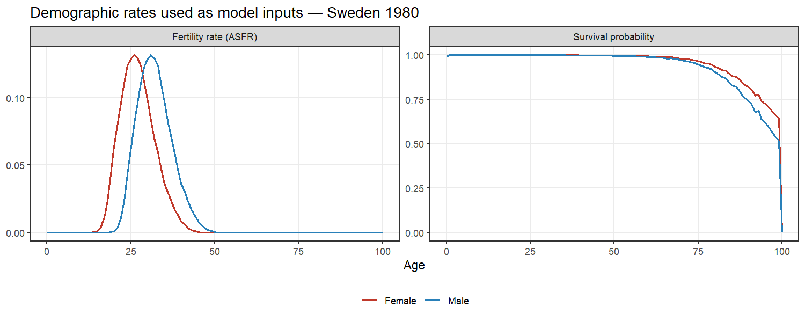
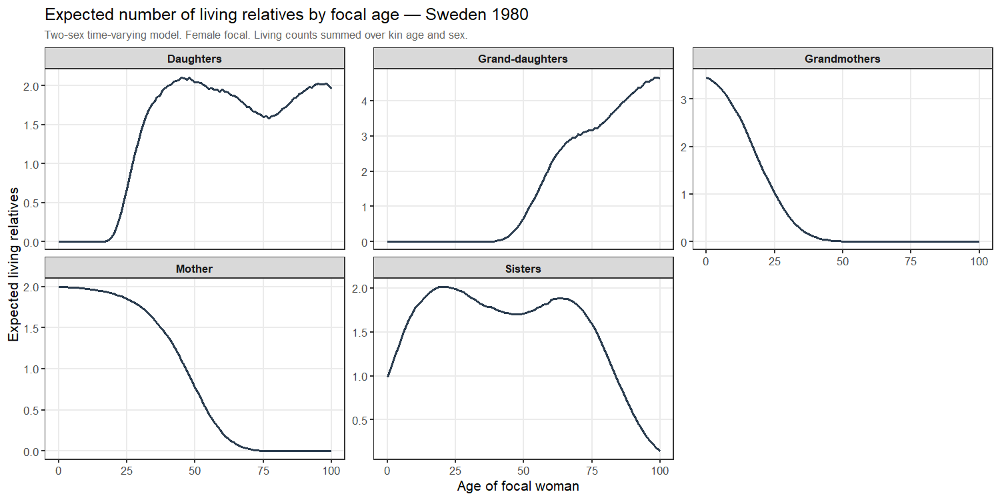
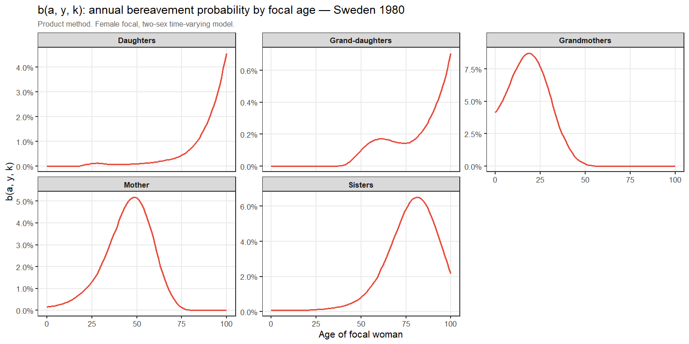
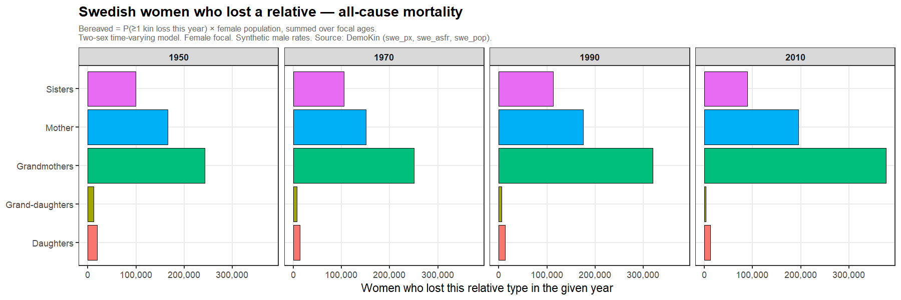

bereavement(): Period Bereavement Estimation with DemoKin
================

- [Background](#background)
  - [What is period bereavement?](#what-is-period-bereavement)
  - [The kinship structure and
    DemoKin](#the-kinship-structure-and-demokin)
  - [The product formula](#the-product-formula)
- [Setup](#setup)
- [Step 1 — Load demographic data](#step-1--load-demographic-data)
- [Step 2 — Compute the kinship structure with
  `kin2sex()`](#step-2--compute-the-kinship-structure-with-kin2sex)
  - [Visualising the kinship
    structure](#visualising-the-kinship-structure)
- [Step 3 — Compute the probability of dying
  (`qx`)](#step-3--compute-the-probability-of-dying-qx)
- [Step 4 — Population data](#step-4--population-data)
- [Step 5 — Run `bereavement()`](#step-5--run-bereavement)
- [Step 6 — Inspect the bereavement probability by
  age](#step-6--inspect-the-bereavement-probability-by-age)
- [Step 7 — Aggregate and summarise](#step-7--aggregate-and-summarise)
- [Step 8 — Plot bereaved counts by kin
  type](#step-8--plot-bereaved-counts-by-kin-type)
- [Input format reference](#input-format-reference)
- [References](#references)

`bereavement()` is an R function that estimates how many people in a
population lose a close relative in a given year. It is designed as a
companion to the [DemoKin](https://github.com/IvanWilli/DemoKin)
package, which provides the underlying kinship model.

This document walks through the full workflow from loading demographic
data to producing bereavement estimates and visualisations. Along the
way it explains the demographic theory behind every step, so it can
serve as both a user guide and a methods reference.

------------------------------------------------------------------------

## Background

### What is period bereavement?

A **period bereavement estimate** answers the question: *In a given
calendar year, how many people lost at least one relative of type k?*
This is a cross-sectional measure — a snapshot for a specific year — not
a life-course cumulative probability.

Formally, for a focal individual of age *a* in year *y*, define:

    b(a, y, k) = P(focal person loses ≥1 relative of type k during year y)

where *b* stands for the **bereavement probability** (not to be confused
with *q_x*, the probability of dying used as input). The number of
bereaved people of age *a* in year *y* is then:

    B(a, y, k) = b(a, y, k) × N(a, y)

where `N(a, y)` is the number of people of age *a* alive in year *y*.
Summing over all ages gives the total bereaved count for kin type *k* in
year *y*.

### The kinship structure and DemoKin

To compute `q0`, we first need to know how many living relatives of each
type a person of age *a* is expected to have in year *y* — and how old
those relatives are. This is the **kinship structure**, a central
concept in formal demography.

Caswell (2019, 2022) showed that the kinship structure can be derived
from a matrix population model. Given age-specific survival
probabilities and fertility rates, the model tracks expected kin counts
through the recursive structure of family trees. For example: the
expected number of living mothers aged *a’* for a focal person of age
*a* in year *y* depends on fertility rates *a* years ago and survival
rates in every year since.

The `DemoKin` package implements this model in R. Its `kin2sex()`
function runs a **two-sex, time-varying** version of the model,
incorporating separate male and female demographic rates that can change
over time. The output is a data frame `kin_full` with one row per
combination of:

| Column      | Meaning                                                  |
|-------------|----------------------------------------------------------|
| `year`      | Calendar year                                            |
| `age_focal` | Age of the focal person (0–100)                          |
| `kin`       | Relationship type (see table below)                      |
| `age_kin`   | Age of the relative (0–100)                              |
| `sex_kin`   | Sex of the relative (`"f"` or `"m"`)                     |
| `living`    | Expected number of living relatives with this profile    |
| `dead`      | Cumulative expected deaths of this kin type up to `year` |

Common kin type codes:

| Code | Relationship | Notes |
|----|----|----|
| `m` | Parent (mother/father) | Expected count peaks near 1 at birth |
| `d` | Child | Grows as focal person has children |
| `gm` | Grandparent |  |
| `gd` | Grandchild |  |
| `s` / `os` / `ys` | Sibling (older/younger) |  |
| `a` / `oa` / `ya` | Aunt or uncle |  |
| `n` / `nos` / `nys` | Niece or nephew |  |
| `c` / `coa` / `cya` | Cousin |  |

Because `living` is derived from a deterministic matrix model, it is a
**continuous-valued** expected count, not an integer. A focal person
aged 30 might have an expected 0.73 grandmothers aged 68 alive — the
average over the population, not a count for any specific individual.

### The product formula

Given the kinship structure, how do we compute `b(a, y, k)`?

`bereavement()` uses the **product method** (also called the “Kike
method”). The only assumption it requires is that the deaths of
different relatives during year *y* are **independent** given their age
and sex.

Under independence, if there were exactly *K* relatives of a given
age-sex profile, the probability that all of them survive year *y* would
be the familiar binomial expression `(1 - q)^K`. The difficulty is that
`living` — the expected kin count returned by DemoKin — is a
**continuous real number**, not an integer. It is the expected value of
a random variable, not an observed count.

**Why `living` is continuous and where Poisson enters.** DemoKin
implements a deterministic matrix population model whose solution gives
the *mean* number of relatives at each age. In the underlying stochastic
process (a multitype branching process), the number of relatives of a
given type converges, for large populations, to a **Poisson
distribution** with mean equal to `living`. This is a consequence of the
law of rare events: each relative’s existence depends on a long chain of
independent demographic events (surviving childbirth, surviving to
reproductive age, surviving to the focal’s birth year, etc.), and such
chains produce Poisson-distributed counts in the limit.

**The point-mass approximation.** The product formula extends
`(1 - q)^K` to continuous `living` by substituting the expected value
for the random variable — treating the Poisson-distributed count as if
it were fixed at its mean:

    P(all living relatives of this age-sex profile survive) ≈ (1 - q) ^ living
                                                             = exp(living × log(1 - q))

This is a **point-mass (mean-field) approximation**, not an exact
result. If we used the full Poisson distribution exactly, the correct
expression via the probability generating function `G(z) = exp(μ(z-1))`
evaluated at `z = (1-q)` would be:

    P(all survive) [Poisson-exact] = exp(-living × q)          ← PGF of Poisson at (1-q)
    P(all survive) [product method] = exp(living × log(1 - q)) ← point-mass approximation

These differ because `log(1-q) ≈ -q` only for small *q*. For typical
demographic mortality levels — annual death probabilities in the range
0.001 to 0.05 — the two are numerically indistinguishable. For very high
mortality (conflict, famine, pandemic), they diverge: the Poisson-exact
formula yields a slightly higher bereavement probability than the
product formula. The product method is therefore a valid and widely-used
approximation for populations under normal or moderately elevated
mortality, and a conservative lower bound under extreme mortality.

Taking the product over all ages *a’* and both sexes *g*:

    P(all kin of type k survive | focal age a, year y)
      = ∏_{a', g} (1 - q(a', y, g)) ^ living(a, a', k, y, g)

Therefore:

    b(a, y, k) = 1 - ∏_{a', g} (1 - q(a', y, g)) ^ living(a, a', k, y, g)

Ages with `living = 0` contribute `(1-q)^0 = 1` and drop out of the
product automatically. This means the function only needs the full
`living` surface and age-sex-specific `qx` values; it does not require
any knowledge of the actual family structure of any individual.

> **Two sources of approximation error.** First, the point-mass formula
> replaces the Poisson kin count with its mean, which underestimates
> bereavement slightly when *q* is large (see above). Second, the
> independence assumption fails in populations where death clusters
> within families (conflict, epidemic, famine): deaths become positively
> correlated, so losses concentrate in fewer families than the formula
> predicts — meaning the formula both under- and over-counts depending
> on the quantity of interest (total bereaved vs. per-family depth of
> loss). For populations with such clustering, a Negative Binomial
> extension exists (Alburez-Gutierrez et al. 2024) but is not yet
> implemented here.

------------------------------------------------------------------------

## Setup

Install `DemoKin` from GitHub if needed, then load packages and source
the function:

``` r
# install.packages("remotes")
# remotes::install_github("IvanWilli/DemoKin")

library(DemoKin)
library(tidyverse)

source("bereavement.R")
```

------------------------------------------------------------------------

## Step 1 — Load demographic data

`DemoKin` ships three built-in datasets for Sweden (ages 0–100, years
1900–2018):

- `swe_px`: female annual survival probabilities `p(a, t)` — the
  probability of surviving from age *a* to *a+1* in year *t*
- `swe_asfr`: female age-specific fertility rates — live births per
  woman per year
- `swe_pop`: observed female population counts

``` r
pf <- swe_px    # female survival:  101 ages × 119 years
ff <- swe_asfr  # female fertility: 101 ages × 119 years
```

`DemoKin`’s built-in data are female only. The two-sex model requires
male rates as well. Following the [DemoKin two-sex time-varying
vignette](https://ivanwilli.github.io/DemoKin/articles/1_4_TwoSex_TimeVarying_Age.html),
we construct synthetic male rates:

``` r
n_ages <- nrow(pf)
n_yrs  <- ncol(pf)

# Male survival: raised to power 1.5 → uniformly lower than female (male excess mortality)
pm <- pf ^ 1.5
dimnames(pm) <- dimnames(pf)

# Male fertility: shift female ASFR 5 years to the right → later mean age at fathering
fm <- rbind(matrix(0, 5, n_yrs), ff[-((n_ages - 4):n_ages), ])
dimnames(fm) <- dimnames(ff)
```

Let’s check what these rates look like for a single year:

``` r
yr_show <- "1980"

bind_rows(
  tibble(age = 0:100, sex = "Female", component = "Survival probability",  value = pf[, yr_show]),
  tibble(age = 0:100, sex = "Male",   component = "Survival probability",  value = pm[, yr_show]),
  tibble(age = 0:100, sex = "Female", component = "Fertility rate (ASFR)", value = ff[, yr_show]),
  tibble(age = 0:100, sex = "Male",   component = "Fertility rate (ASFR)", value = fm[, yr_show])
) |>
  ggplot(aes(age, value, colour = sex)) +
  geom_line(linewidth = 0.8) +
  facet_wrap(~ component, scales = "free_y") +
  scale_colour_manual(values = c(Female = "#c0392b", Male = "#2980b9")) +
  labs(
    title  = paste("Demographic rates used as model inputs — Sweden", yr_show),
    x = "Age", y = NULL, colour = NULL
  ) +
  theme_bw(base_size = 11) +
  theme(legend.position = "bottom", panel.grid.minor = element_blank())
```

<!-- -->

Male survival is lower at all ages. Male fertility peaks about 5 years
later than female fertility. These are the rates that drive the kinship
model.

------------------------------------------------------------------------

## Step 2 — Compute the kinship structure with `kin2sex()`

`kin2sex()` is the two-sex kinship model in `DemoKin`. It takes survival
and fertility matrices for both sexes and returns, for every (focal age
× year × kin type × kin age × kin sex) combination, the expected number
of living and dead relatives.

Key arguments:

| Argument | Description |
|----|----|
| `pf`, `pm` | Female and male survival probability matrices (101 ages × *n* years) |
| `ff`, `fm` | Female and male fertility matrices (same dimensions) |
| `sex_focal` | Sex of the focal individual (`"f"` or `"m"`) |
| `time_invariant` | `FALSE` uses rates that change over time (time-varying model) |
| `birth_female` | Proportion of births that are female (typically `1/2.04 ≈ 0.49`) |
| `output_kin` | Which relationship types to compute (limits time and memory) |

The time-varying model (`time_invariant = FALSE`) is computationally
intensive — it must propagate rates from every birth cohort’s birth year
to the present. Results are cached automatically on first run.

``` r
kin_out <- kin2sex(
  pf = pf, pm = pm,
  ff = ff, fm = fm,
  sex_focal      = "f",
  time_invariant = FALSE,
  birth_female   = 1 / 2.04,
  output_kin     = c("d", "gd", "gm", "m", "s")
)
kin_full <- kin_out$kin_full
```

``` r
nrow(kin_full)             # total rows
```

    ## [1] 12139190

``` r
range(kin_full$year)       # years covered
```

    ## [1] 1900 2018

``` r
sort(unique(kin_full$kin)) # kin types computed
```

    ## [1] "d"  "gd" "gm" "m"  "s"

Here is what the first few rows look like:

``` r
kin_full |>
  filter(year == 1980, age_focal == 40, kin == "m") |>
  arrange(sex_kin, age_kin) |>
  filter(living > 0) |>
  head(10)
```

    ## # A tibble: 10 × 8
    ##    kin   age_kin age_focal sex_kin cohort  year     living        dead
    ##    <chr>   <int>     <int> <chr>    <int> <int>      <dbl>       <dbl>
    ##  1 m          53        40 f         1940  1980 0.00000888 0          
    ##  2 m          54        40 f         1940  1980 0.0000550  0.000000413
    ##  3 m          55        40 f         1940  1980 0.000434   0.00000188 
    ##  4 m          56        40 f         1940  1980 0.00217    0.0000114  
    ##  5 m          57        40 f         1940  1980 0.00758    0.0000415  
    ##  6 m          58        40 f         1940  1980 0.0168     0.000116   
    ##  7 m          59        40 f         1940  1980 0.0288     0.000157   
    ##  8 m          60        40 f         1940  1980 0.0315     0.000208   
    ##  9 m          61        40 f         1940  1980 0.0372     0.000287   
    ## 10 m          62        40 f         1940  1980 0.0407     0.000319

Each row describes one (age × sex) slice of a kin type for a particular
focal person profile. The `living` column is the expected number of
relatives with that exact age and sex still alive.

### Visualising the kinship structure

To build intuition, let’s look at the expected number of living
relatives by focal age for a single year:

``` r
kin_full |>
  filter(year == 1980) |>
  summarise(living = sum(living), .by = c(age_focal, kin)) |>
  rename_kin(sex = "f") |>
  ggplot(aes(age_focal, living)) +
  geom_line(colour = "#2c3e50", linewidth = 0.8) +
  facet_wrap(~ kin_label, scales = "free_y", nrow = 2) +
  labs(
    title   = "Expected number of living relatives by focal age — Sweden 1980",
    subtitle = "Two-sex time-varying model. Female focal. Living counts summed over kin age and sex.",
    x = "Age of focal woman", y = "Expected living relatives"
  ) +
  theme_bw(base_size = 10) +
  theme(
    plot.subtitle    = element_text(colour = "grey40", size = 8),
    panel.grid.minor = element_blank(),
    strip.text       = element_text(face = "bold")
  )
```

<!-- -->

This is the kinship structure that feeds into the bereavement
calculation. For example, a 30-year-old Swedish woman in 1980 expected
to have roughly one living parent, no grandchildren yet, several
siblings, and a growing number of children.

------------------------------------------------------------------------

## Step 3 — Compute the probability of dying (`qx`)

The bereavement model needs `qx`: the probability that a person aged *x*
dies within the year. This is derived from the survival probabilities:

    qx = 1 - px

**Terminal age problem.** `swe_px[age = 100] = 0` because everyone in
the open age group (100+) is assumed to die within the year in this life
table. That gives `qx = 1`, which collapses the product formula to zero
for any focal person with living kin aged 100+, and triggers an error in
`bereavement()`.

The fix is to approximate `qx` at age 100 using the **force of
mortality** (`mx`) from age 99. The standard relationship between `px`
and `mx` under a constant-hazard assumption within the age interval is
`qx = 1 - exp(-mx)`, or equivalently `mx = -log(px)`. Since `px[99]` is
well-defined, we compute `mx[99] = -log(px[99])` and use it as our
approximation for `mx[100]`, giving `qx[100] = 1 - exp(-mx[99])`. This
assumes a roughly constant force of mortality at the oldest ages, which
is reasonable for period life tables. In a formal analysis, use
`DemoTools::lt_single_mx()` to derive qx from mx for all ages
consistently.

``` r
# qx = 1 - px for ages 0-99 (exact)
qx_f <- 1 - pf
qx_m <- 1 - pm

# Terminal age (row 101, age 100): px = 0 by life table convention → qx = 1.
# Approximate using mx from age 99: qx[100] = 1 - exp(-mx[99]) = 1 - px[99]
mx_f_99 <- -log(pf[100, ])   # force of mortality at age 99 (row index 100)
mx_m_99 <- -log(pm[100, ])
qx_f[101, ] <- 1 - exp(-mx_f_99)
qx_m[101, ] <- 1 - exp(-mx_m_99)

dimnames(qx_f) <- dimnames(pf)
dimnames(qx_m) <- dimnames(pm)

range(qx_f)
```

    ## [1] 0.00000 0.46453

``` r
range(qx_m)
```

    ## [1] 0.0000000 0.6081655

------------------------------------------------------------------------

## Step 4 — Population data

`swe_pop` contains observed female population counts for Sweden by age
and year. This is the population of focal women — we need it to convert
per-capita probabilities into head counts:

    B(a, y, k) = b(a, y, k) × N(a, y)

``` r
pop_mat <- swe_pop
dimnames(pop_mat) <- list(as.character(0:100), colnames(swe_pop))

# Total Swedish women in selected years
colSums(pop_mat)[as.character(c(1950, 1970, 1990, 2010))] |>
  formatC(format = "d", big.mark = ",") |>
  print()
```

    ##        1950        1970        1990        2010 
    ## "3,505,510" "4,007,824" "4,314,868" "4,691,066"

------------------------------------------------------------------------

## Step 5 — Run `bereavement()`

`bereavement()` applies the product formula to every combination of
(year, focal age, kin type) in `kin_full` and returns a tidy data frame.

**Arguments:**

| Argument | Description |
|----|----|
| `kin_full` | Data frame from `kin2sex()` or `kin()` |
| `qx` | Probability of dying. Named list `list(f = ..., m = ...)` in two-sex mode |
| `pop` | Population counts. Named list `list(f = ..., m = ...)` in two-sex mode; the function sums both sexes to get total population per (age, year), which is used as the focal count and denominator for `bereaved_prop` |
| `output_year` | `NULL` computes for all years in `kin_full`; pass a vector to restrict |

**Accepted input formats for `qx` and `pop`:**

- A matrix with dimnames (ages as rownames, years as colnames)
- A long data frame with columns `year`, `age`, and the value column
- A named list `list(f = <matrix>, m = <matrix>)` for two-sex inputs

Because `kin_full` has a `sex_kin` column, both `qx` and `pop` must be
named lists with `f` and `m` entries. `qx` is sex-specific because the
death probability applied to each relative must match that relative’s
sex. `pop` is sex-specific so that the function can compute the total
(female + male) population as the denominator for `bereaved_prop`.

`DemoKin` ships only female Swedish population data, so we pass
`swe_pop` for both sexes here — the total population will be doubled,
which is an approximation. In a real study, supply the observed male
population as `m`:

``` r
result <- bereavement(
  kin_full    = kin_full,
  qx          = list(f = qx_f, m = qx_m),
  pop         = list(f = pop_mat, m = pop_mat),  # female pop used for both (demo only)
  output_year = NULL
)

glimpse(result)
```

    ## Rows: 60,095
    ## Columns: 5
    ## $ year          <int> 1900, 1900, 1900, 1900, 1900, 1900, 1900, 1900, 1900, 19…
    ## $ age_focal     <int> 0, 1, 2, 3, 4, 5, 6, 7, 8, 9, 10, 11, 12, 13, 14, 15, 16…
    ## $ kin           <chr> "d", "d", "d", "d", "d", "d", "d", "d", "d", "d", "d", "…
    ## $ bereaved      <dbl> 0.000000, 0.000000, 0.000000, 0.000000, 0.000000, 0.0000…
    ## $ bereaved_prop <dbl> 0.0000000000000, 0.0000000000000, 0.0000000000000, 0.000…

Each row is one combination of (year, focal age, kin type). The columns
are:

| Column | Description |
|----|----|
| `year` | Calendar year |
| `age_focal` | Age of the focal woman |
| `kin` | Relationship type code |
| `bereaved` | Expected number of bereaved women at this age = `b(a,y,k) × N(a,y)` |
| `bereaved_prop` | `bereaved / N(year)` — this age’s contribution to the total bereaved share |

------------------------------------------------------------------------

## Step 6 — Inspect the bereavement probability by age

Before aggregating to counts, it is useful to look at `b(a, y, k)` — the
per-capita bereavement probability — for a single year. This shows how
the risk of losing each kin type varies across the life course.

`bereaved_prop` in the output is `b(a,y,k) × N(a,y) / N_total(y)` — the
age-specific bereaved share. Dividing by the age’s population share
recovers `b(a,y,k)`:

``` r
result |>
  filter(year == 1980) |>
  left_join(
    tibble(
      age_focal = 0:100,
      # total pop used inside bereavement() = pop_f + pop_m = 2 × pop_mat (demo)
      pop_share = (2 * pop_mat[, "1980"]) / sum(2 * pop_mat[, "1980"])
    ),
    by = "age_focal"
  ) |>
  mutate(p_ber = bereaved_prop / pop_share) |>   # recover b(a, y, k)
  rename_kin(sex = "f") |>
  ggplot(aes(age_focal, p_ber)) +
  geom_line(colour = "#e74c3c", linewidth = 0.8) +
  scale_y_continuous(labels = scales::percent_format(accuracy = 0.1)) +
  facet_wrap(~ kin_label, scales = "free_y", nrow = 2) +
  labs(
    title    = "b(a, y, k): annual bereavement probability by focal age — Sweden 1980",
    subtitle = "Product method. Female focal, two-sex time-varying model.",
    x = "Age of focal woman", y = "b(a, y, k)"
  ) +
  theme_bw(base_size = 10) +
  theme(
    plot.subtitle    = element_text(colour = "grey40", size = 8),
    panel.grid.minor = element_blank(),
    strip.text       = element_text(face = "bold")
  )
```

<!-- -->

For a 30-year-old Swedish woman in 1980, there was roughly a 1–2% chance
of losing a parent in that year. Child loss is very low at that age (few
children old enough to face significant mortality risk). Grandparent
loss peaks in mid-life, when grandparents are typically in their 70s and
80s.

------------------------------------------------------------------------

## Step 7 — Aggregate and summarise

`result` has one row per (year, focal age, kin). To get the **total
bereaved women** per kin type per year, sum over all focal ages:

``` r
summary_by_year <- result |>
  summarise(
    bereaved      = sum(bereaved),
    bereaved_prop = sum(bereaved_prop),   # = total bereaved / total women in year
    .by = c(year, kin)
  ) |>
  rename_kin(sex = "f")   # adds human-readable kin_label column

# Print the % of Swedish women bereaved in four selected years
summary_by_year |>
  filter(year %in% c(1950, 1970, 1990, 2010)) |>
  mutate(pct = round(bereaved_prop * 100, 2)) |>
  select(year, kin_label, pct) |>
  pivot_wider(names_from = year, values_from = pct) |>
  arrange(kin_label)
```

    ## # A tibble: 5 × 5
    ##   kin_label       `1950` `1970` `1990` `2010`
    ##   <chr>            <dbl>  <dbl>  <dbl>  <dbl>
    ## 1 Daughters         0.27   0.17   0.16   0.13
    ## 2 Grand-daughters   0.17   0.09   0.06   0.03
    ## 3 Grandmothers      3.46   3.12   3.7    4.02
    ## 4 Mother            2.37   1.88   2.03   2.09
    ## 5 Sisters           1.42   1.32   1.31   0.95

Note that `sum(bereaved_prop)` over focal ages equals
`total_bereaved / total_population`, which is the overall per-capita
bereavement rate for that kin type and year. The decline across decades
for parents and grandparents reflects declining mortality in Sweden; the
rise in child and grandchild losses tracks the changing population age
structure.

------------------------------------------------------------------------

## Step 8 — Plot bereaved counts by kin type

``` r
plot_years <- c(1950, 1970, 1990, 2010)

summary_by_year |>
  filter(year %in% plot_years) |>
  ggplot(aes(y = bereaved, x = kin_label, fill = kin_label)) +
  geom_bar(
    stat = "identity", colour = "black", linewidth = 0.25,
    show.legend = FALSE
  ) +
  scale_y_continuous(labels = scales::label_comma()) +
  coord_flip() +
  facet_wrap(~ year, nrow = 1) +
  labs(
    title    = "Swedish women who lost a relative — all-cause mortality",
    subtitle = paste0(
      "Bereaved = P(\u22651 kin loss this year) \u00d7 female population, summed over focal ages.\n",
      "Two-sex time-varying model. Female focal. Synthetic male rates. Source: DemoKin (swe_px, swe_asfr, swe_pop)."
    ),
    x = NULL,
    y = "Women who lost this relative type in the given year"
  ) +
  theme_bw(base_size = 11) +
  theme(
    plot.title       = element_text(face = "bold"),
    plot.subtitle    = element_text(size = 8, colour = "grey40"),
    strip.text       = element_text(face = "bold"),
    panel.grid.minor = element_blank()
  )
```

<!-- -->

Parent loss accounts for the largest single category throughout the
period, followed by grandparent loss. The absolute counts increase from
1950 to 2010 primarily because the total Swedish female population grew.
The shift in the relative ordering of kin types over time reflects both
demographic transition (falling mortality, lower fertility) and the
changing age structure of the population.

------------------------------------------------------------------------

## Input format reference

`qx` and `pop` each accept any of the following formats:

``` r
# 1. A matrix (ages × years) — most compact for DemoKin data
qx_f_mat  # 101 × n matrix with integer rownames (ages) and colnames (years)

# 2. A long data frame (single sex)
tibble(year = 1980L, age = 0:100, qx = qx_f_mat[, "1980"])

# 3. A long data frame (two-sex, with sex column)
tibble(year = 1980L, age = 0:100, sex = "f", qx = qx_f_mat[, "1980"])

# 4. A named list of matrices (two-sex) — used in the demo above
list(f = qx_f_mat, m = qx_m_mat)
```

In two-sex mode (`kin_full` has a `sex_kin` column), both `qx` and `pop`
must be named lists — the function enforces this. In one-sex mode, both
are single matrices.

------------------------------------------------------------------------

## References

Caswell, H. (2019). The formal demography of kinship: A matrix
formulation. *Demographic Research*, 41, 679–712.

Caswell, H. (2022). Formal demography of kinship IV: Two-sex models.
*Demographic Research*, 47, 359–396.

Alburez-Gutierrez, D. et al. (2024). *Science Advances*, 10, eado6951.
<https://doi.org/10.1126/sciadv.ado6951>
